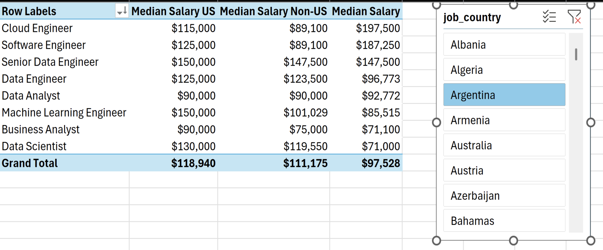

#  Job & Skills Analysis – Excel Analytics Project

---

##  Project Overview
The **Job & Skills Analysis** project is an Excel-based analytics tool that visualizes trends in job postings and the demand for specific skills. It offers insights into how job counts and skill frequencies evolve over time, leveraging interactive charts and pivot-based analysis.

This project answers:
- Which skills are most sought after in the job market?
- How do job counts for different roles trend over time?
- What patterns emerge when analyzing job vs. skill demand?

---

##  Project Structure

- **1_Project_Analysis.xlsx** → Main Excel workbook containing data, pivot tables, and interactive charts  
- **2_Project_Analysis_Chart1.png** → Visual output for job count trends (e.g., time series or bar chart)  
- **2_Project_Analysis_Chart2.png** → Visualization highlighting most in-demand skills (e.g., word cloud or bar chart)  
- **2_Project_Analysis_Screenshot2.png** → Screenshot of the interactive dashboard or slicer panel  
- **2_Project_Analysis_Screenshot5.png** → Additional insight visualization or summary chart  
- **README.md** → Project documentation  

---

##  Dashboard Walkthrough

### 1. Job Count Trends
  
This chart displays the **number of job postings over time** (e.g., monthly or quarterly), helping identify hiring surges, seasonal trends, or overall growth in job demand.

---

### 2. In-Demand Skills Visualization
  
This visualization highlights the most frequently listed skills in job postings—perfect for understanding what employers are currently seeking.

---

### 3. Interactive Analysis Screenshot
  
A snapshot of the Excel file showing **interactive filters** (like dropdowns or slicers), allowing users to switch between roles, skills, or time periods to dynamically update views.

---

### 4. Additional Insights Screenshot
  
Another view showing deeper breakdowns—perhaps role-based skill comparison or combined charts that highlight job vs. skill correlations.

---

##  Dataset & Analysis Highlights
The dataset includes job postings with attributes such as:
- Posting Date (Month/Quarter)
- Job Role/Title
- Required Skills (possibly multiple per posting)
- Job Count by time and skill

Using Excel features like Pivot Tables and charts, the analysis reveals:
- Trend lines in hiring activity  
- Bar charts or word clouds showing top skills  
- Insightful dashboards combining filters and visuals

---

##  How to Use
1. Download **`1_Project_Analysis.xlsx`**  
2. Open it in **Microsoft Excel 2016 or later**  
3. Interact using **pivot-based slicers**, dropdowns, or other filters  
4. Hover over charts for details and context

---

##  Tools & Techniques Used
- **Microsoft Excel**  
  - Pivot Tables & Charts  
  - Slicers & Data Validation Dropdowns  
  - Power Query (if used for data shaping)  
- Optional visuals like **Word Clouds** or advanced charts to highlight key skills  

---

##  Key Insights
- Patterns in hiring growth over time  
- Most demanded skills across job postings  
- Role-specific skill highlights (e.g., which skills matter most for Data Scientists vs. Analysts)

---

##  Contribution Guidelines
Love to refine this further? Contributions are welcome!  
To contribute:
1. Fork the repository  
2. Create a new branch (`feature-add-statistics`)  
3. Commit your enhancements (e.g., new charts, deeper insights, automation)  
4. Submit a Pull Request to merge your improvements

---

##  About Me
**Author:** Sneha  
I’m passionate about translating job market data into actionable insights using Excel and visual analytics. Feel free to reach out or collaborate—let’s elevate this analysis together!

---
